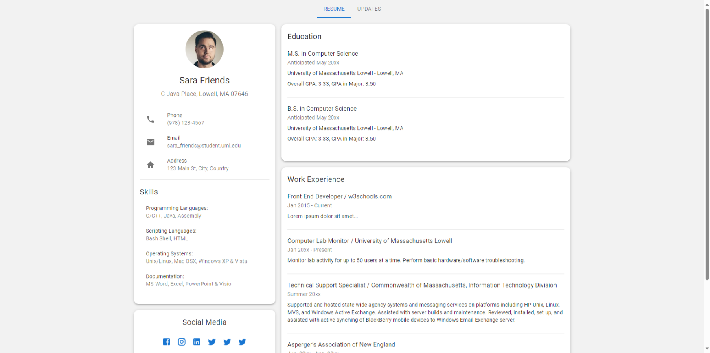

# React Material-UI Portfolio

A responsive and dynamic portfolio website, built with React and MUI (formerly Material-UI) v5 for Computer Science students at UMass Lowell. The website is designed to be easily customizable, allowing students to quickly create a portfolio to showcase their skills and experiences.



- Template inspired from W3Schools' [Portfolio Template](https://www.w3schools.com/howto/tryw3css_templates_cv.htm)
- Resume template from UML Career Services for [Computer Science majors](https://www.uml.edu/docs/Effective-Resume-Guide-Rev1_tcm18-312086.pdf)

You can view a demo of the portfolio here: https://codesandbox.io/p/github/UMLCloudComputing/react-mui-resume/main

You can see a customized demo version live here: https://www.cs.uml.edu/~mmarwad/

## Tutorial 

This guide is for students who want to host their portfolio on the UML CS servers. This guide assumes you have a CS linux account on the UML CS servers. If you do not have a CS linux account, please contact the CS department.

### Connect to UML CS Server & Install Node.js

Connect to the UML CS servers using SSH. If you are not on campus wifi, then you will need to use the [UML VPN](https://www.uml.edu/it/services/get-connected/remote-access/). 

```bash
ssh <cs-username-here>@cs.uml.edu
```

Now that you are connected to the CS servers, you will need to install Node.js. We will be using nvm to install Node.js. 
```bash
wget -qO- https://raw.githubusercontent.com/nvm-sh/nvm/v0.39.3/install.sh | bash
```

Source the bashrc file to use nvm.
```bash
source ~/.bashrc
```

Now that nvm is installed, we can install Node.js. We will be using Node.js v18.
```bash
nvm install v18
```

```bash
nvm use v18
```

### Clone the Repository

Clone the repository and install the dependencies.
```bash
git clone https://github.com/UMLCloudComputing/react-mui-resume
```

Change directory into the repository.
```bash
cd react-mui-resume
```

Install the JavaScript dependencies.
```bash
npm install
```

### Build and Deploy to `public_html` Folder

Build the project. This will create a `build` folder with the static HTML files. Make sure to replace `cs-username-here` with your CS username. This is needed to set the `PUBLIC_URL` environment variable, which is used to set the base URL for the static files.

```bash
PUBLIC_URL=https://www.cs.uml.edu/~<cs-username-here>/ npm run build
```

Copy the contents of the `build` folder into the `public_html` folder. This folder is used to host static files on the CS servers.

```bash
cp -r build/* ~/public_html/
```

Change the permissions of the `public_html` folder to `755`. This will allow the web server to access the files.

```bash
chmod -R 755 ~/public_html/
```

### View Your Portfolio

You can now view your portfolio at `https://www.cs.uml.edu/~<cs username here>/`. 

This will show the default portfolio. You can now customize the portfolio to your liking.

## Customization

To customize the portfolio, you can edit the `src/TEMPLATE.js` file. This file contains a JavaScript object with all the information for the portfolio. Feel free to edit it to your liking.

Additionally, if you are familiar with React, you can edit the React components in the `/src` folder and customize the portfolio even further using MUI components and styling.

## License

This project is licensed under the MIT License - see the [LICENSE](LICENSE) file for details.
